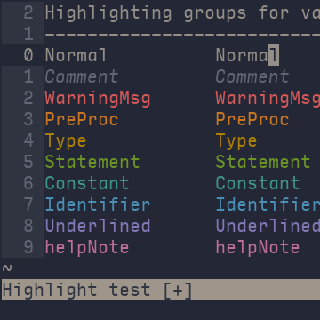
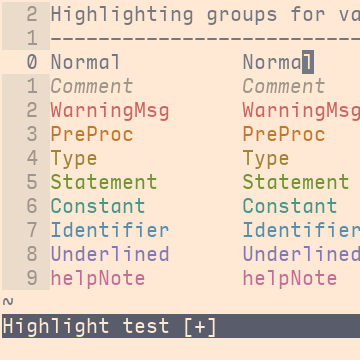

# stellarized

The [solarized](http://ethanschoonover.com/solarized) theme, inspired by reading a book under a shady tree on a sunny day, features a palette of base colours that grade from dark, highly saturated green-blue (hue 192) to bright, lightly saturated orange-yellow (hue 44).

**stellarized** recalibrates the solarized theme with the [colours of the stars](http://www.vendian.org/mncharity/dir3/starcolor/details.html). The four darker base colours are shifted to hue 225, the approximate colour of the hotter stars of the universe, while the four lighter base colours take on hue 30, found in the colder stars. Saturation levels are adjusted to mirror those of the stars: namely, saturation is lowest in middle temperatures, rising at the extremes.

Small adjustments were made to base colour brightness in order to snap values to a 1/24 grid. Accent colours were (HSV grid-snap) adjusted by eye to suit the new backgrounds.

## screenshots

<table style="text-align:center;font-weight:bold">
<tbody>
<tr>
<td>stellarized_dark</td>
<td>stellarized_light</td>
</tr>
<tr>
<td>

</td>
<td>

</td>
</tr>
</tbody>
</table>

## installation

If you don’t have a preferred **plugin helper**, consider trying [vim-plug](<a href="https://github.com/junegunn/vim-plug), which can be installed with:

```
curl -fLo ~/.vim/autoload/plug.vim --create-dirs \
  https://raw.githubusercontent.com/junegunn/vim-plug/master/plug.vim
```

To install stellarized using vim-plug, add the following to the top of your `vimrc`:

```
call plug#begin('~/.vim/plugged')
Plug 'nightsense/stellarized'
call plug#end()
```

Then restart vim and run `PlugUpdate` (from the vim command line).

## activation

To activate stellarized, add one of the following to your `vimrc`:

```
colorscheme stellarized_dark
```

```
colorscheme stellarized_light
```
